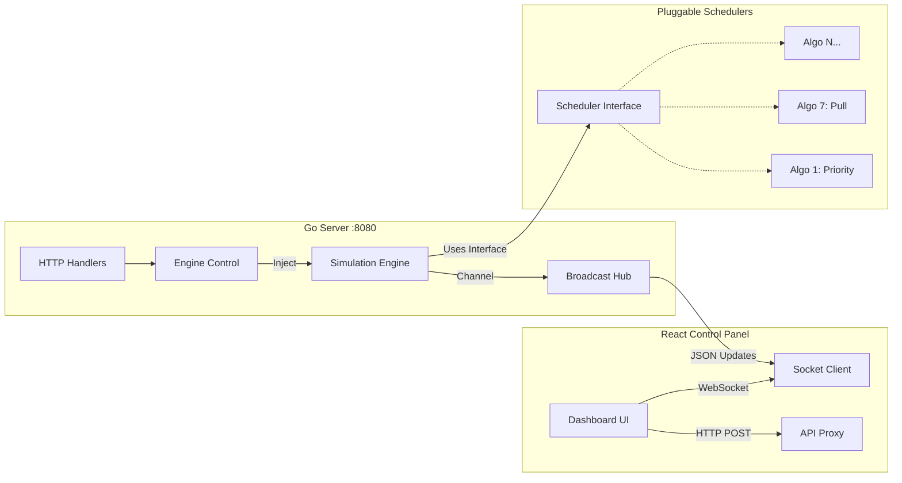
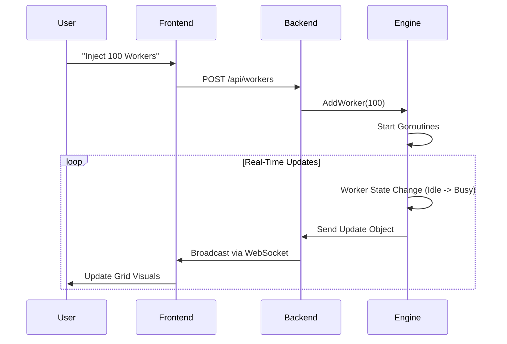

# Simulator Architecture

## Full Stack Overview
The Simulator runs a React Frontend and a Go Backend connected via WebSocket.

```mermaid
graph LR
    subgraph Frontend [React Control Panel]
        UI[Dashboard UI] -- HTTP POST --> API[API Proxy]
        UI -- WebSocket --> WS[Socket Client]
    end

    subgraph Backend [Go Server :8080]
        H[HTTP Handlers] --> E[Engine Control]
        E -->|Inject| SIM[Simulation Engine]
        
        hub[Broadcast Hub] -- JSON Updates --> WS
        SIM -- Channel --> hub
    end
    
    subgraph Algorithms [Pluggable Schedulers]
        SIM -->|Uses Interface| I[Scheduler Interface]
        I -.-> A1[Algo 1: Priority]
        I -.-> A7[Algo 7: Pull]
        I -.-> An[Algo N...]
    end
```

## Event Loop
How state flows from the engine to the user.

```mermaid
sequenceDiagram
    participant U as User
    participant F as Frontend
    participant B as Backend
    participant E as Engine
    
    U->>F: "Inject 100 Workers"
    F->>B: POST /api/workers
    B->>E: AddWorker(100)
    E->>E: Start Goroutines
    
    loop Real-Time Updates
        E->>E: Worker State Change (Idle -> Busy)
        E->>B: Send Update Object
        B->>F: Broadcast via WebSocket
        F->>U: Update Grid Visuals
    end
```
