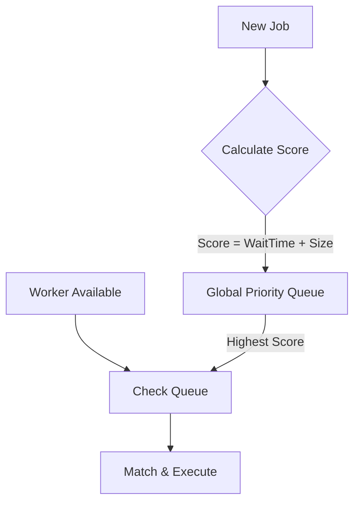
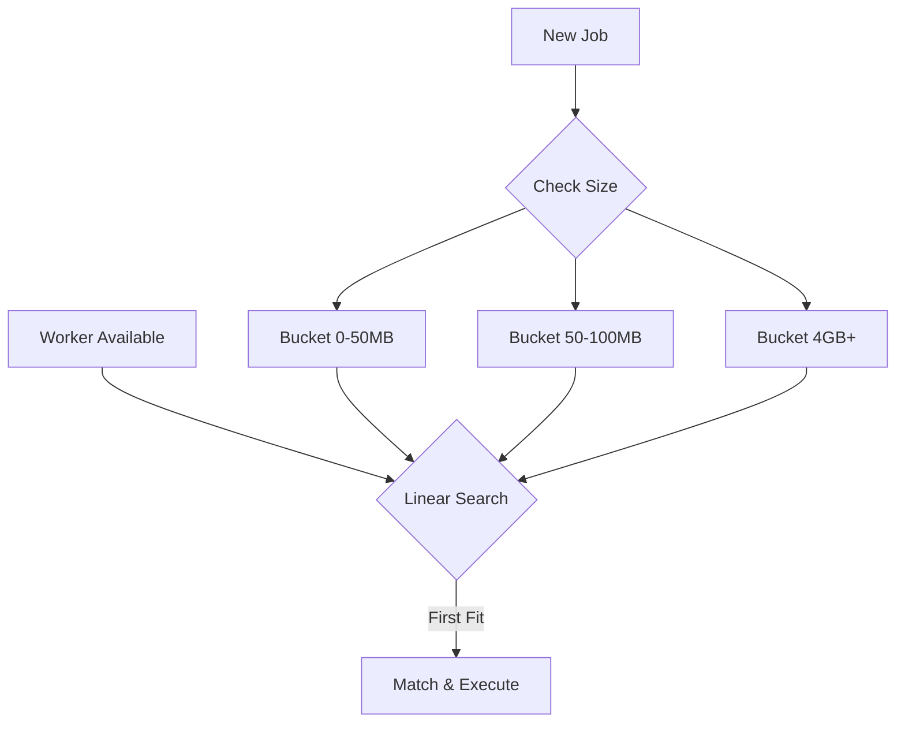
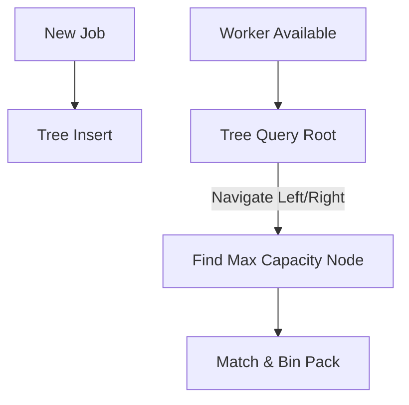
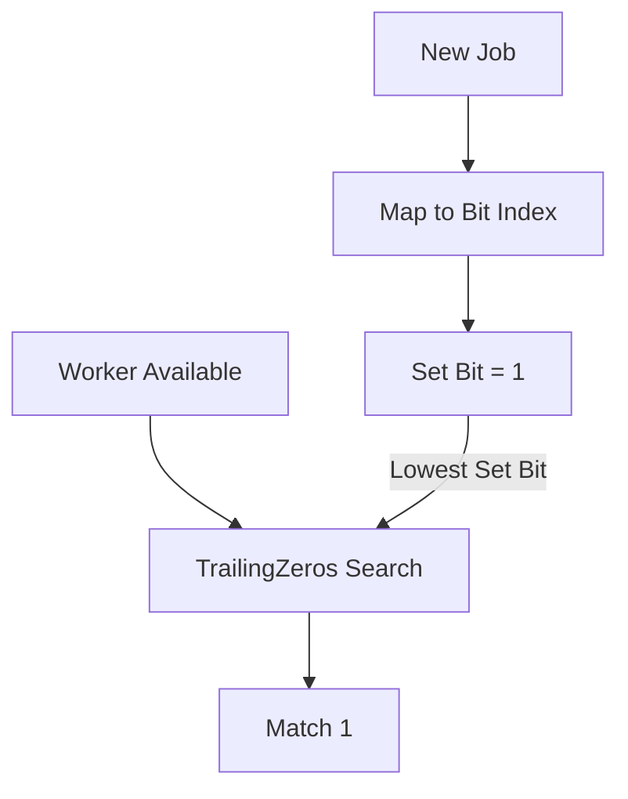
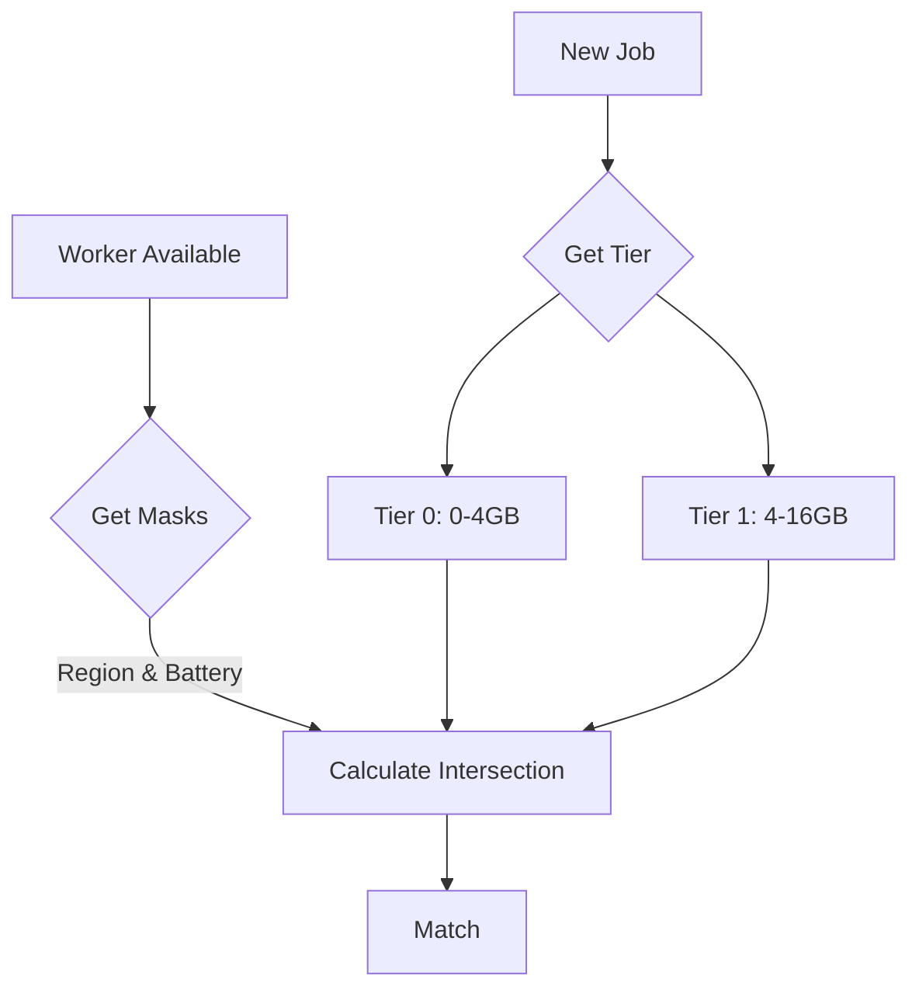
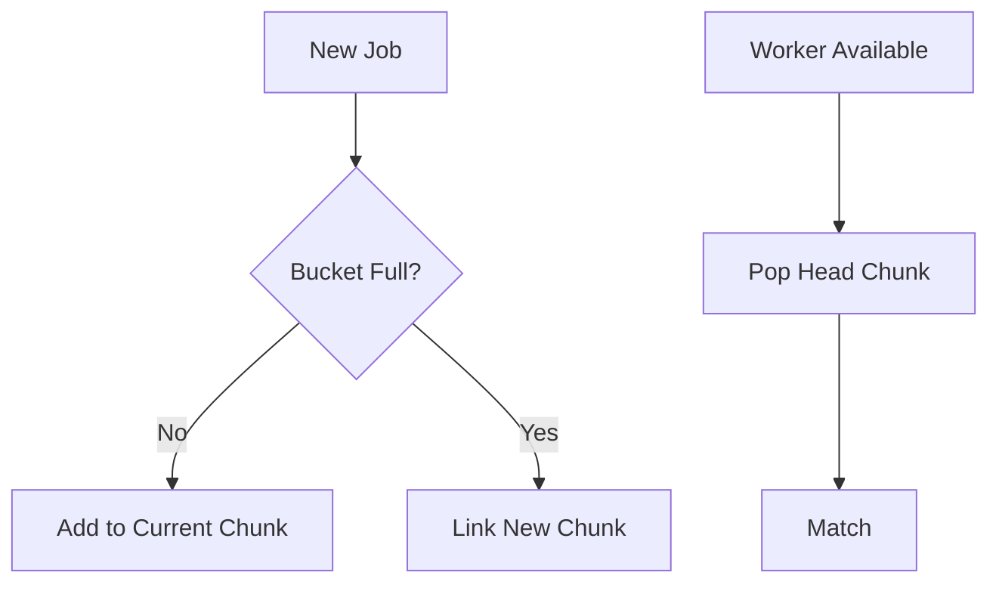
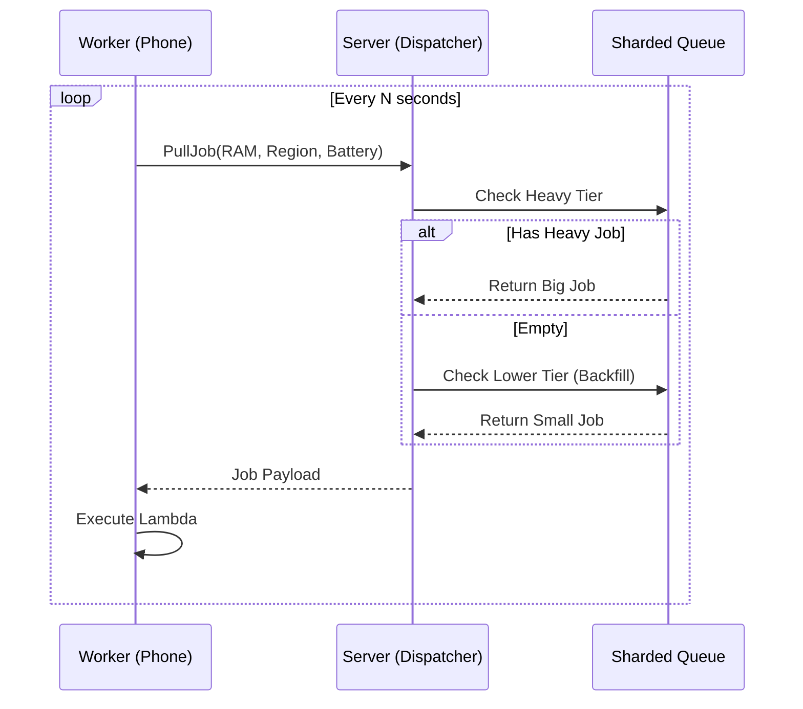

# Algorithm Workflows

## Algo 1: Priority Queue (Score Based)
Push Model. Uses `container/heap` with a scoring formula to prioritize jobs.

## Algo 2: Bucket Reservation
Push Model. Uses fixed buckets (e.g., 0-50MB) to organize jobs.

## Algo 3: Segment Tree (Logarithmic)
Push Model. Uses a Segment Tree to find the best fit in $O(\log N)$.

## Algo 4: O(1) Bitmask
Push Model. Uses CPU bitwise operations for instant matching.

## Algo 5: Tiered Bitmask
Push Model. Multi-dimensional filtering with tiered memory ranges.

## Algo 6: Linked Queue (Infinite Density)
Push Model. Linked-List of Arrays to handle millions of identical items.

## Algo 7: Yggdrasil (Pull Based)
Pull Model. Inversion of control where workers request work.

